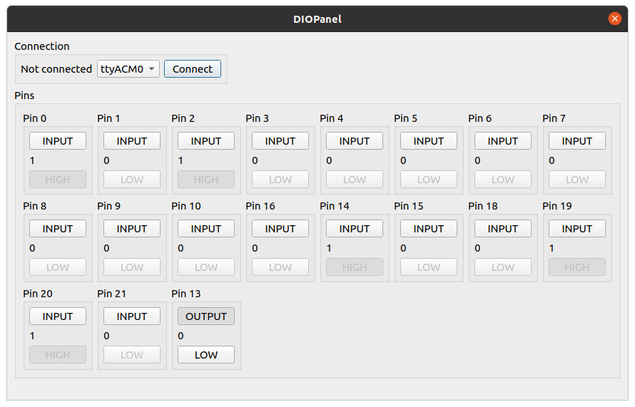

## Digital IO Panel
This Qt application interfaces via serial port to an Arduino etc. to control the pin direction and read/set pin values.

Pins used are set in the firmware. Currently the following pins are enabled: 
```
// https://golem.hu/pic/pro_micro_pinout.jpg
#define NUM_PROMICRO_PINS 19
uint8_t promicro_pins[NUM_PROMICRO_PINS] = {0,1,2,3,4,5,6,7,8,9,10,16,14,15,18,19,20,21,13};
```

These show up in the user interface upon initial connection and may then be controlled. The current UI is shown below.

